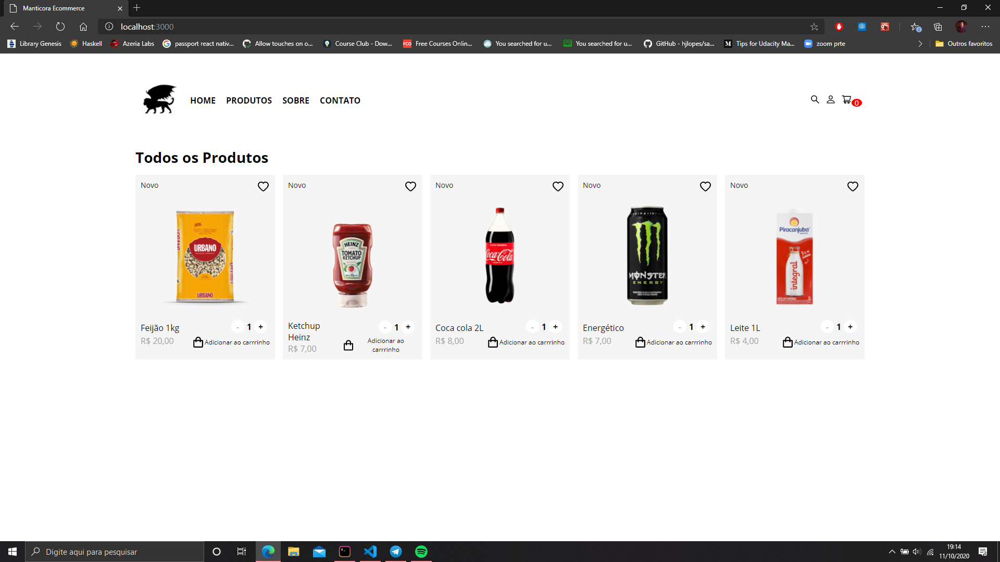
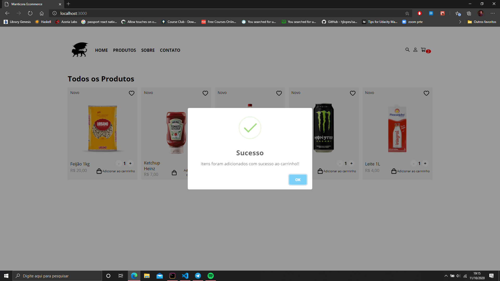
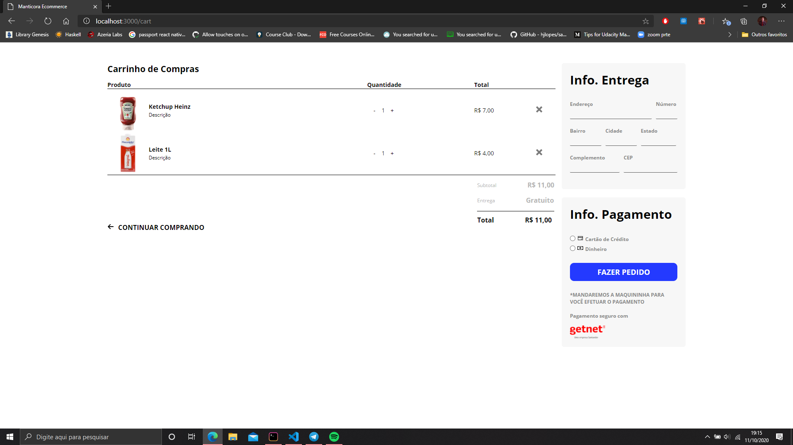
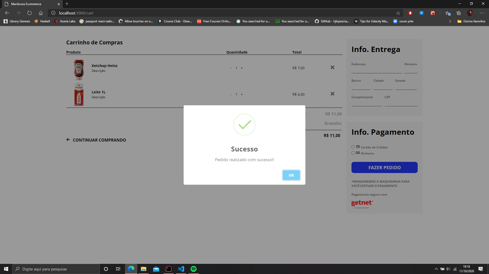

<h1 align="center">Bem-vindo a Loja Virtual da Manticora 👋</h1>
<p>
  
  <a href="LICENSE" target="_blank">
    
  </a>
</p>

> Uma loja virtual simples pra ajudar o seu João do mercadinho da esquina, ou a dona Maria da frutaria da rua de cima, a lucrarem mais e controlarem melhor o seu negócio.
> Feito com ❤ por Manticora.app.

### 🏠 [Homepage](manticora.app)

### ✨ [Demo](lojavirtual.manticora.app)

## Requerimentos

[x] NodeJS (para rodar o comando npm)

## Instalação

```sh
git clone https://github.com/manticorasolution/manticora-ecommerce.git
cd manticora-ecommerce
npm i
```

## Instruções de Uso

```sh
npm run start
```

## Autor

👤 **Marcos Santana**

- Github: [@zerocoolbr](https://github.com/zerocoolbr)
- LinkedIn: [@marcosbrs](https://linkedin.com/in/marcosbrs)

### E se não quiser, baixar...






## 📝 License

Copyright © 2020 [Manticora Solutions](https://github.com/manticorasolution).<br />
This project is [MIT](LICENSE) licensed.

_This README was generated with ❤️ by [readme-md-generator](https://github.com/kefranabg/readme-md-generator)_
